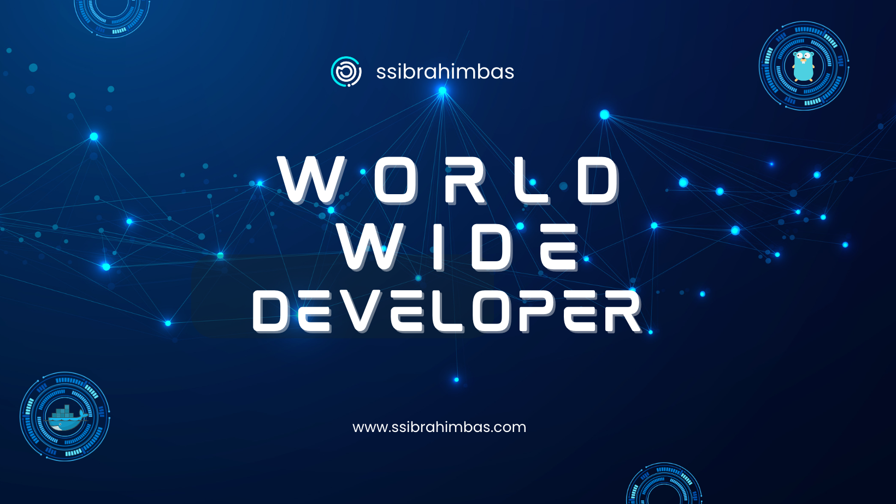

  

<h3 align="center">Connect with me:</h3>

  

<a href="https://github.com/ssibrahimbas/ssibrahimbas/blob/main/ssi.pdf" target="_blank">View Resume</a>

 

  

&nbsp;

&nbsp;

&nbsp;

&nbsp;

 

